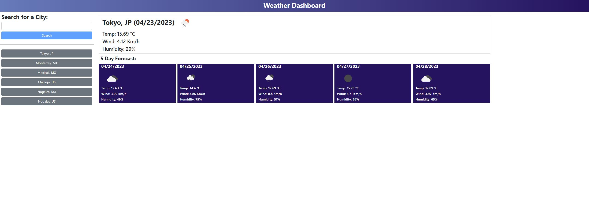

# Weather_App
06 Challenge

# Description
This web app is designed to allow users to search for and view the current weather conditions and a five-day forecast for cities around the world. The app includes a search function that allows users to search for cities by name, and an autocomplete feature that suggests cities as the user types. The app also has a history function that stores previously searched cities and allows users to quickly access their weather information.
## Acceptance Critetia
```
GIVEN a weather dashboard with form inputs
WHEN I search for a city
THEN I am presented with current and future conditions for that city and that city is added to the search history
WHEN I view current weather conditions for that city
THEN I am presented with the city name, the date, an icon representation of weather conditions, the temperature, the humidity, and the wind speed
WHEN I view future weather conditions for that city
THEN I am presented with a 5-day forecast that displays the date, an icon representation of weather conditions, the temperature, the wind speed, and the humidity
WHEN I click on a city in the search history
THEN I am again presented with current and future conditions for that city
```

# Code Snippets
## HTML code for the Search components and the button history list
```HTML
<div class="col-2">
    <div class="p-2 mb-3">
        <label for="exampleFormControlInput1" class="form-label h3 fw-bold">Search for a City:</label>
        <input type="text" class="form-control" id="search_bar" />
        <button id="search_btn" type="submit" class="mt-2 w-100 btn btn-primary disabled" >Search</button>
    </div>
    <hr>
    <div class="p-2 mb-3 ">
        <div id="buttonCity_list" class="d-grid gap-2">
            
        </div>
    </div>
</div>     
```
### History button structure
Every time there's a successful search, a new button will appear and follow the next structure.
```HTML
<button class="btn btn-secondary" type="button">Button</button>
```
## Daily forecast and 5 day forecast
```HTML
<div class="col-8 me-3 mt-3">
    <div id="today_cast" class="border border-dark ps-3" >
        <div class="row row-cols-auto d-flex align-items-center">
            <h2 id="City" class="col form-label fw-bold "> </h2>
            
        </div>
        
        <h4 id="temp" class="form-label ">Temp:</h4>
        <h4 id="wind" class="form-label ">Wind:</h4>
        <h4 id="humd" class="form-label ">Humidity:</h4>
    </div>
    <div class="p-2 mb-3">
        <label class="form-label h4 fw-bold">5 Day Forecast:</label>
        <div id="5day_cast" class="row ">
        </div>
    </div>
</div>
```
### 5 day forecast Cards
This is the structure used to render the cards when the data is fetched.
```HTML
<div class="col m-1 bg-weather">
    <h5 class="fw-bold">9/14/2022</h4>                                
    
    <h6>Temp:</h6>
    <h6>Wind:</h6>
    <h6>Humidity:</h6>
</div>
```

## JS
### General information
To initialize some global variables are set. 
* API id key and mock data
* HTML document elements
* Set search events
* Global arrays
* Fill the array with the button history
```js
var appid = 'f5cf5cc638b6ea3d999d0a5599e54ea5'
 
var mockAPI5 = './assets/js/mock_data5.json'
var mockAPI1 = './assets/js/mock_data1.json'

var search_btn = document.getElementById('search_btn');
var search_bar = document.getElementById('search_bar');
$('#search_btn').on('click', function(event){search_param(event, 'btn') });
$('#search_bar').on('click', function(event){search_param(event, 'bar') });

var doc_btn_list = document.getElementById('buttonCity_list');

var doc_today_cast = document.getElementById('today_cast');
var doc_5day_cast = document.getElementById('5day_cast');

var doc_today_city = document.getElementById('City');
var doc_today_icon = document.getElementById('Main_icon');
var doc_today_temp = document.getElementById('temp');
var doc_today_wind = document.getElementById('wind');
var doc_today_humd = document.getElementById('humd');

var Selected_city_name ;
var autocomlete_city = [];
var historyCity = [];
var city_list = [];
var Selected_city_info = {};
var Selected_city_today = {};
var Selected_city_5day = [];

var btn_array;

btn_array = JSON.parse(localStorage.getItem('OBJHistory'));
historyCity =JSON.parse(localStorage.getItem('CityHistory'));
if(historyCity==null){
    historyCity=[];
}    console.log(historyCity);

if(btn_array==null){
    btn_array = [];    
}else{
    Selected_city_info = {
        name:btn_array[0].name,
        lat:btn_array[0].lat, 
        lng: btn_array[0].lng,
        country: btn_array[0].country
    };
    console.log(btn_array);
    search_weather_info(Selected_city_info);

    render_btn();
}
```
### World Cities
This function runs after the HTML document is done rendering. It will fetch data from the cities database and store it in an array and create another array containing only the name and country as text for the `autocomplete` function used for the input.
```js
$(
    function(){
        fetch('./assets/js/worldcities.csv')
        .then(response => response.text())
        .then(data => {
            const parsedData = Papa.parse(data, { header: true });
            const dataArray = parsedData.data;
            autocomlete_city = [];
                dataArray.forEach(element => {
                autocomlete_city.push(element.city_ascii+', '+element.iso2);
            });
            city_list = dataArray;
            $('#search_bar').autocomplete({
                source: function( request, response ) {
                    var matcher = new RegExp( "^" + $.ui.autocomplete.escapeRegex( request.term ), "i" );
                    response( $.grep( autocomlete_city, function( item ){
                        return matcher.test( item );
                    }) );
                }
            });
        })
        .catch(error => console.log(error));
    }
);
```
### Render History
To render the history, the list container is reset and then with a `for` loop using the `btn_array`, which is an object array, HTML elements are created, and data from the object list is set on those elements to create the button.
```js
function render_btn(){
    doc_btn_list.innerHTML = '';
    for(var i =0;i<btn_array.length;i++){
        var btn = document.createElement('button');
        btn.setAttribute('class','btn btn-secondary');
        btn.setAttribute('type', 'button');
        btn.setAttribute('id',''+btn_array[i].name+'-'+btn_array[i].country);
        btn.textContent = ''+btn_array[i].name+', '+btn_array[i].country;
        doc_btn_list.appendChild(btn);
        $('#'+btn_array[i].name+'-'+btn_array[i].country).on('click', function(event){
            event.preventDefault();
            console.log(event.target.innerText);
            search_fetch(event.target.innerText);
        });
    }
}
```
### Search
When a search is triggered, it calls for a function named `search-param`. This function has two functions: setting the `button` submit as enabled and triggering the search. When the `input` is clicked, the `button` is enabled, so it won't be pressed on blank data. Once we get the values from the `input`, the function checks if its not null. If its not, it triggers another function and resets the `input` and `button` parameters.
```js
function search_param (src_data, src){
    var value_search = document.getElementById('search_bar');
    if(src_data.type == 'click' && src=='btn'){ 
        if(value_search!= null){
            search_fetch(value_search.value);
            search_btn.setAttribute('value', '');
            value_search.value = '';
        }        
        search_btn.setAttribute('class', 'mt-2 w-100 btn btn-primary disabled');
    }else if(src_data.type == 'click' && src=='bar'){
        search_btn.setAttribute('class', 'mt-2 w-100 btn btn-primary');
    }
}
```
### Fetch the search
Once the search returns something not null, it will be checked in the database, which returns the index of the data in the database. With this, we create an object with all the information from the city: name, latitude, longitude, and country. Then, the function checks if it already exists in the history, so there aren't any double entries. If the city is not in the history, it will save the city in the history and the object in the btn_array. Next, it will render the history buttons again with the new entry. At the end, it will call a function that is called independently if the data exists in the array or not: `search_weather_info`. This whole function is called when the search button is pressed or when a history button is pressed.
```js
function search_fetch(input_data){    
    const index =  autocomlete_city.indexOf(input_data);
    try{
        Selected_city_info = {
                name:city_list[index].city_ascii,
                lat:city_list[index].lat, 
                lng: city_list[index].lng,
                country: city_list[index].iso2
            };        
    if(historyCity.indexOf(input_data)==(-1)){
        historyCity.push(input_data);
        console.log(historyCity);
        localStorage.setItem('CityHistory', JSON.stringify(historyCity));
            
        btn_array = JSON.parse(localStorage.getItem('OBJHistory'));
        if(btn_array==null){        
            btn_array=[];
        }
        btn_array.push(Selected_city_info);
        console.log(btn_array);
        localStorage.setItem('OBJHistory', JSON.stringify(btn_array));
        
        render_btn();
    }
    search_weather_info(Selected_city_info);   
    }catch{
        console.error();
    }  
}
```
## search_weather_info
This function will call the API function with the corresponding parameter for each one of the calls.
```js
function search_weather_info(city_info){

    webAPI5 = 'https://api.openweathermap.org/data/2.5/forecast?lat='+city_info.lat+'&lon='+city_info.lng+'&appid='+appid+'&units=metric'
    webAPI1 = 'https://api.openweathermap.org/data/2.5/weather?lat='+city_info.lat+'&lon='+city_info.lng+'&appid='+appid+'&units=metric'
    
    call_API1(webAPI1);
    call_API5(webAPI5);
}
```
## API Fetch
Once the response of the fetch is returned, the function will parse and send the data to a function that will format the data into something that is useful for the webpage
```js
function call_API1(web) {
    data = fetch(web)
    .then(response => response.json())
    .then(obj =>{
        data = JSON.parse(JSON.stringify(obj));
        todayCast(data);
    });
} 
function call_API5(web){
    data = fetch(web)
    .then(response => response.json())
    .then(obj =>{
        data = JSON.parse(JSON.stringify(obj));
        //console.log(data.list);
        Five_dayCast(data.list);
    });
}
```
### Today data and Rendering
The data has a large number of objects and arrays. It selects the data that is needed and formatted into a global object that contains all the necessary information to display on the screen. Just then, the render_today function is called.
Once the function is called, it will change the `textContent` of the HTML element or the `setAttribute` for the icons.
```js
function todayCast(data){
    Selected_city_today = {
        date: dayjs.unix(data.dt).format('MM/D/YYYY'),
        icon: 'https://openweathermap.org/img/wn/'+data.weather[0].icon+'@2x.png',
        desc: data.weather[0].description,
        temp: data.main.temp,
        wind: data.wind.speed,
        humd: data.main.humidity
    };    
    render_today();    
}

function render_today(){
    doc_today_city.textContent = Selected_city_info.name+', '+Selected_city_info.country+' ('+Selected_city_today.date+')';
    doc_today_icon.setAttribute('src',''+Selected_city_today.icon);
    doc_today_icon.setAttribute('alt',''+Selected_city_today.desc);
    doc_today_temp.textContent = 'Temp: '+Selected_city_today.temp+' °C';
    doc_today_wind.textContent = 'Wind: '+Selected_city_today.wind+' Km/h';
    doc_today_humd.textContent = 'Humidity: '+Selected_city_today.humd+'%';

}
```
### Five day Forecast data and Rendering
The data from the 5-day forecast contains an extensive amount of data, so that function filters down the data and gets the necessary elements from the data and stores them in a local object that will be pushed into a global object array `Selected_city_5day` and calls the function `render_5day`.
 After the `render_5day` function is called, it begins by clearing the previous forecast data from the HTML document. Then, using a `for` loop, it creates a container for each day's forecast data, including the date, weather icon, temperature, wind speed, and humidity. Finally, it appends each container to the HTML document.
```js
function Five_dayCast(data){
    Selected_city_5day = [];
    data.forEach(element => {
        if(dayjs.unix(element.dt).format('H') == 12){       
            var Selected_city_week = {
                date: dayjs.unix(element.dt).format('MM/D/YYYY'),
                icon: 'https://openweathermap.org/img/wn/'+element.weather[0].icon+'@2x.png',
                desc: element.weather[0].description,
                temp: element.main.temp,
                wind: element.wind.speed,
                humd: element.main.humidity
            };
            Selected_city_5day.push(Selected_city_week);
        }
    });    
    render_5day();
}
function render_5day(){
    doc_5day_cast.innerHTML = '';
    for(var i = 0;i<Selected_city_5day.length;i++){
        
        var cardContainer = document.createElement('div');
        cardContainer.setAttribute('class', 'col m-1 bg-weather');

        var date = document.createElement('h5');
        date.setAttribute('class','fw-bold');
        date.textContent = Selected_city_5day[i].date;
        
        var icon = document.createElement('img');
        icon.setAttribute('class','ms-3');
        icon.setAttribute('style','height: 75px; width: 75px;');
        icon.setAttribute('src',''+Selected_city_5day[i].icon);
        icon.setAttribute('alt',''+Selected_city_5day[i].desc);

        var temp = document.createElement('h6');
        temp.textContent = 'Temp: '+Selected_city_5day[i].temp+' °C';
        
        var wind = document.createElement('h6');
        wind.textContent = 'Wind: '+Selected_city_5day[i].wind+' Km/h';
        
        var humd = document.createElement('h6');
        humd.textContent = 'Humidity: '+Selected_city_5day[i].humd+'%';
        
        cardContainer.appendChild(date);
        cardContainer.appendChild(icon);
        cardContainer.appendChild(temp);
        cardContainer.appendChild(wind);
        cardContainer.appendChild(humd);
        doc_5day_cast.appendChild(cardContainer);
    }
}
```
# Screenshots

# Video


# Pages Link
Website Link [Github Pages Link](https://santis1001.github.io/Weather_App/)